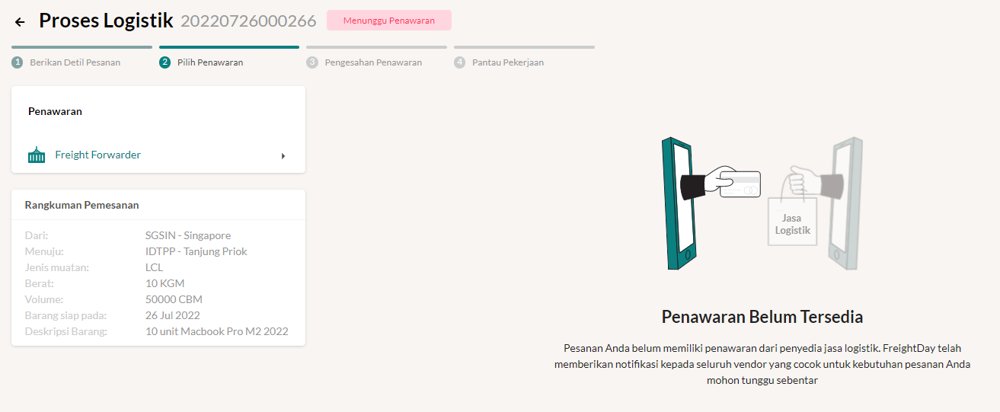
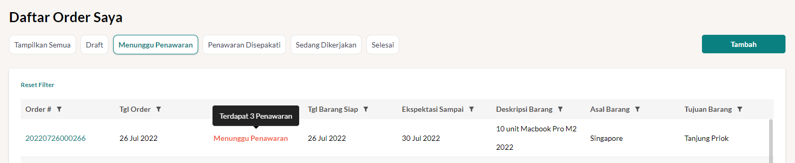
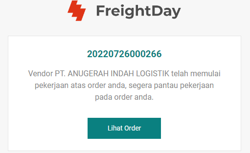
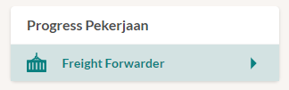
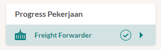

# Order Saya
Seluruh order dan pekerjaan Anda akan terlihat pada order yang akan difilter bedasarkan status. FreightDay memberikan kemudahan bagi Anda importir ataupun eksportir dalam pemesanan jasa logistik melalui data order.

## Daftar Order Saya
Untuk dapat melihat order apa saja yang sudah dibuat sebagai customer, silahkan:
1. Klik **Order Saya** pada menu
2. Klik **Order Saya** pada sidebar
3. Akan tampil seluruh order yang pernah dibuat sebelumnya
4. Jika Anda belum membuat order sama sekali, maka tampilan ini akan kosong

::: info
Tampilan ini akan tetap kosong jika Anda belum [Membuat Order Logistik](#membuat-order-logistik-baru)
:::

## Memberikan Detil Pesanan
Untuk dapat memesan jasa logistik, silahkan:
1. Klik **Order Saya** pada menu
2. Klik **Order Saya** pada sidebar
3. Klik **Tambah**
4. Panel **Impor/Ekspor**
   1. Masukan jenis transaksi yang Anda inginkan (import, export, atau domestik)
   2. Masukan incoterm yang ingin dipilih
5. Panel **Freight Forwarder**
   1. Pilih apakah Anda membutuhkan Freight Forwarder atau tidak 
      ::: warning
      Sebelum memilih silahkan pahami terlebih dahulu mengenai [Jenis Order](/overview/jenisorder)
      :::
   2. Jika Anda membutuhkan Freight Forwarder, maka silahkan beri tahu FreightDay dokumen apa saja yang ingin diuruskan
6. Panel **Moda Transportasi**  
    Panel ini bersifat opsional, jika Anda memilih incoterm EXW atau FOB maka panel ini akan muncul.
    Jika Anda membutuhkan Freight Forwarder pada nomor 5 maka akan ada pertanyaan lanjutan apakah Anda ingin 
    1. Terpadu  
    Anda akan berurusan dengan Freight Forwarder saja  
    [Penjelasan Lebih Lanjut](/overview/jenisorder#_2-order-mandiri)
    2. Mandiri  
    Anda akan berurusan langsung dengan pihak Pelayaran/Penerbangan  
    [Penjelasan Lebih Lanjut](/overview/jenisorder#_3-order-terpadu-mandiri-hybrid)
7. Panel **Informasi Barang**
   1. Masukan deskripsi barang secara garis besar
      ::: info
      Jika Anda membutuh impor lebih dari satu barang, silahkan masukan menggunakan enter atau baris baru
      :::
   2. Beserta seluruh informasi yang dapat melengkapi barang tersebut
8. Panel **Informasi Pos Tarif**
   Masukan seluruh informasi Pos Tarif atau HS Code yang menyertai barang tersebut
9.  Panel **Kebutuhan Truk**  
    Jika Anda membutuhkan Freight Forwarder pada nomor 5 maka akan ada pertanyaan lanjutan apakah Anda ingin 
    1. Terpadu  
    Anda akan berurusan dengan Freight Forwarder saja  
    [Penjelasan Lebih Lanjut](/overview/jenisorder#_2-order-mandiri)
    2. Mandiri  
    Anda akan berurusan langsung dengan pihak Truk  
    [Penjelasan Lebih Lanjut](/overview/jenisorder#_3-order-terpadu-mandiri-hybrid)
10. Panel **Kebutuhan Gudang**  
    Jika Anda membutuhkan Freight Forwarder pada nomor 5 maka akan ada pertanyaan lanjutan apakah Anda ingin 
    1. Terpadu  
    Anda akan berurusan dengan Freight Forwarder saja  
    [Penjelasan Lebih Lanjut](/overview/jenisorder#_2-order-mandiri)
    2. Mandiri  
    Anda akan berurusan langsung dengan pihak Gudang  
    [Penjelasan Lebih Lanjut](/overview/jenisorder#_3-order-terpadu-mandiri-hybrid)
11. Jika Anda sudah mengisi semua informasi, maka kebutuhan logistik Anda akan disebarkan ke FreightDay Network.
    Silahkan menunggu penawaran atas jasa logistik yang Anda masukan.
    

## Melihat Penawaran Masuk
Untuk dapat memantau ada berapa penawaran yang sudah masuk, silahkan:
1. Klik **Order Saya** pada menu
2. Klik **Order Saya** pada sidebar
3. Klik **Menunggu Penawaran** pada bagian atas tabel
4. Arahkan mouse Anda ke status Menunggu Penawaran
5. Akan tampil tampilan seperti di bawah ini

## Melakukan Negosiasi
1. Masuk ke order yang sudah mendapatkan penawaran, dengan cara klik **Nomor Order**
2. Pilih vendor preferensi Anda
3. Klik **Negosiasi**
4. Masukan harga negosiasi yang tepat menurut Anda
5. Masukan pesan pada chat box
6. Klik tanda kirim 
7. Silahkan menunggu respon dari vendor Anda untuk melanjutkan ke tahap berikutnya

## Memilih dan Mengesahkan Vendor
Jika sudah dicapai kesepakatan harga maka, silahkan:
1. Pilih vendor preferensi Anda
2. Klik **Pilih**
3. Maka Anda akan lanjut ke bagian **Pengesahan Penawaran**
4. Pastikan jumlah dibayar sudah benar pada panel bagian kiri bawah
5. Pastikan rangkuman pemesanan sudah benar pada panel bagian kanan bawah
6. Klik **Template Surat Perjanjian**
7. Cetak Surat Perjanjian tersebut
8. Silahkan tanda tangani secara basah
9. Unggah Surat Perjanjian yang telah ditanda tangani pada kolom **Surat Perjanjian**
10. Kirimkan dokumen tersebut melalui kurir
11. Klik **Lanjutkan**
12. Selanjutnya pihak vendor akan meninjau legalitas perusahaan Anda dan melakukan pengecekan terhadap kontrak
13. Jika Anda sudah menerima email seperti pada gambar di bawah, berarti vendor logistik Anda sudah menyetujui dan akan memulai pekerjaan
    

## Pemantauan Pekerjaan
Untuk dapat memantau pekerjaan dari vendor logistik, silahkan:
1. Klik **Order Saya** pada menu
2. Klik **Order Saya** pada sidebar
3. Klik **Sedang Dikerjakan** pada bagian atas tabel
4. Plih order yang ingin Anda pantau pekerjaannya
5. Sampaikan pesan pada bagian dengan cara klik chat box
6. Masukan pesan yang ingin Anda sampaikan
7. Jika dibutuhkan lampiran silahkan klik tanda klip kertas, kemudian browse file yang ingin Anda lampirkan
8. Klik **Kirim**

## Konfirmasi Penyelesaian 
Jika pekerjaan sudah diselesaikan oleh pihak Freight Forwarder, maka panel **Progress Pekerjaan** akan berubah dari yang sebelumnya, belum memiliki tanda centang seperti pada gambar di bawah

menjadi

Untuk dapat memberikan konfirmasi penyelesaian pekerjaan, silahkan:
1. Klik **Order Saya** pada menu
2. Klik **Order Saya** pada sidebar
3. Klik **Sedang Dikerjakan** pada bagian atas tabel
4. Plih order yang ingin Anda konfirmasi selesai
5. Pastikan sudah pada panel **progress pekerjaan** sudah memiliki tanda centang seperti yang sudah dijelaskan sebelumnya
6. Klik **Pekerjaan Telah Selesai**
