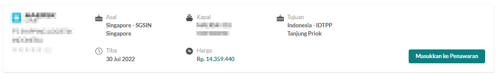

# Kolam Order
Kolam order adalah menu di mana para vendor bisa melihat terdapat proyek logistik apa saja yang masih bisa diberikan penawaran.

## Memberikan Penawaran
1. Klik **Kolam Order** pada bagian menu
2. Klik salah satu **nomor order** untuk dapat melihat order secara lebih detil
3. Tinjau kebutuhan importir atau eksportir atas jasa logistik
4. Jika vendor merasa mampu untuk mengerjakan, silahkan klik **Lanjutkan**
::: warning
Sebelum memberikan penawaran silahkan untuk mempelajari hal ini terlebih dahulu  
[Jenis Order](/overview/jenisorder#_3-order-terpadu-mandiri-hybrid)
:::
5. Jika tersedia jadwal pelayaran yang cocok untuk order tersebut, Anda bisa memilih dan mengklik **Minta Penawaran**
::: details Pelayaran 
Dengan klik **Minta Penawaran**, pihak pelayaran akan menerima notifikasi, untuk selanjutnya memberikan harga.  
Jika sebelum diklik **Minta Penawaran**, maka tampilan akan seperti gambar di bawah 

Jika sesudah diklik **Minta Penawaran**, maka tampilan akan seperti gambar di bawah 

Jika sesudah diklik **Minta Penawaran**, dan sudah direspon oleh vendor maka tampilan akan seperti gambar di bawah 

:::

::: warning 
Akan terdapat variasi pada langkah ini
:::

1. Jika Anda menganggap harganya cukup kompetitif, dan Anda sebagai Freight Forwarder tertarik, silahkan klik **Masukan ke Penawaran**.
2. Harga tersebut akan disalin ke Penawaran yang Anda berikan kepada calon pelanggan
::: info
Jika Anda tidak tertarik pada vendor logistik FreightDay, silahkan klik **Lewati**
:::
8. Masukan komponen harga apa saja yang akan Anda bebankan kepada calon pelanggan

::: details Hapus Detail
User dapat melakukan pengisian komponen harga dengan menggunakan template, dengan cara sebagai berikut:
1. Pilih komponen harga yang ingin dihapus
2. Lalu user dapat menekan tombol **Hapus Detail**
:::

::: details Gunakan Template 
User dapat melakukan pengisian komponen harga dengan menggunakan template, dengan cara sebagai berikut:
1. Menuju menu **Pengelolaan**
2. Pilih **Template Penawaran**
3. Klik **Tambah**
4. Isikan **Nama Template**
5. Membuat **Detil Template**
6. Klik **Simpan**
7. Menuju menu **Penawaran**
8. Klik tombol **Gunakan Template**
9. Pilih **Nama Template** yang sudah dibuat
10. Maka secara otomatis, detil template yang sudah dibuat tadi, akan terbentuk pada kompenen harga
:::

::: details Simpan Template Penawaran
User dapat melakukan pembuatan template menggunakan komponen harga yang sudah dibuat, dengan cara sebagai berikut:
1. Mengisikan komponen harga yang akan dibebankan kepada calon pelanggan
2. Pilih kompnen harga apa saja yang ingin disimpan menggunakan template, dengan menekan tombol kotak yang berada di sebelah nama komponen
3. Setelah selesai memilih, user dapat menekan tombol **Simpan Template Penawaran**
4. Iisikan **Nama Template**
5. Klik **Setuju**
6. Maka secara otomatis akan membuatkan template dengan nama template yang sudah diisikan tadi, dan untuk detail template nya akan terisi dengan kompnen harga yang sudah dipilih
:::

::: info
Untuk mempermudah user dalam membuat komponen harga, user dapat melakukan pengecekan pesanan yang sudah disediakan pada bagian kanan kolom **Rangkuman Pemesanan**
:::
9. Jika sudah memasukan seluruh komponen biaya silahkan klik **Ajukan Penawaran**
10. Silahkan tunggu sampai dengan Penawaran anda direspon oleh pelanggan

## Melakukan Negosiasi
Jika harga Anda dinegosiasi oleh pelanggan Anda bisa melakukan 
1. Klik ikon **chat** pada kanan bawah
2. Jika Anda ingin melakukan Negosiasi ulang, silahkan klik **Negosiasi **pada chat box
3. Masukan harga negosiasi yang tepat menurut Anda
4. Masukan pesan pada chat box
5. Klik tanda **kirim** 

## Pengesahan Penawaran
Setelah negosiasi mencapai kesepakatan harga, dan pelanggan sudah mengunggah file surat perjanjian, maka Anda dapat melakukan peninjauan legalitas
1. Klik **Pekerjaan Saya** pada menu bar
2. Klik **Penawaran** pada side bar
3. Filter yang memiliki status **Disetujui**
4. Klik salah satu **nomor penawaran**
5. Unduh seluruh dokumen legalitas
6. User dapat melakukan import kembali dokumen **Surat Perijinan** yang telah ditanda tangani oleh kedua belah pihak
7. Tinjau ulang seluruh dokumen legalitas
8. Jika peninjauan sudah selesai silahkan klik **Mulai Pekerjaan**

::: tip
Anda seharusnya hanya klik **Mulai Pekerjaan**, di saat Anda sudah yakin dapat mengerjakan proyek logistik tersebut, dengan harga yang telah disepakati sebelumnya
:::