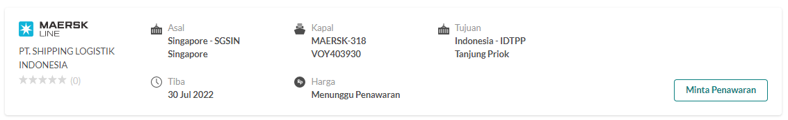
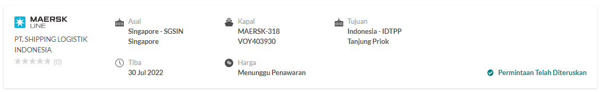

# Kolam Order
Kolam order adalah menu di mana para vendor bisa melihat terdapat proyek logistik apa saja yang masih bisa diberikan penawaran.

## Memberikan Penawaran
1. Klik **Kolam Order** pada bagian menu
2. Klik salah satu **nomor order** untuk dapat melihat order secara lebih detil
3. Tinjau kebutuhan importir atau eksportir atas jasa logistik
4. Jika vendor merasa mampu untuk mengerjakan, silahkan klik **Lanjutkan**
::: warning
Sebelum memberikan penawaran silahkan untuk mempelajari hal ini terlebih dahulu  
[Jenis Order](/overview/jenisorder#_3-order-terpadu-mandiri-hybrid)
:::
5. Jika tersedia jadwal pelayaran yang cocok untuk order tersebut, Anda bisa memilih dan mengklik **Minta Penawaran**
::: info
Dengan klik **Minta Penawaran**, pihak pelayaran akan menerima notifikasi, untuk selanjutnya memberikan harga.

:::