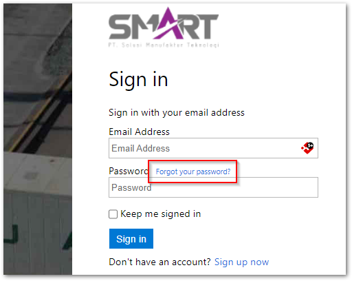
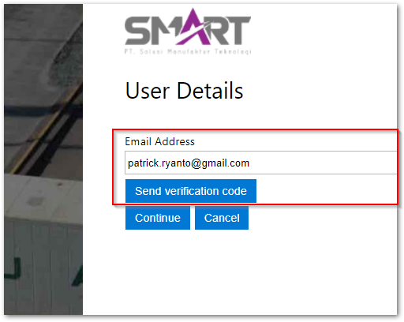
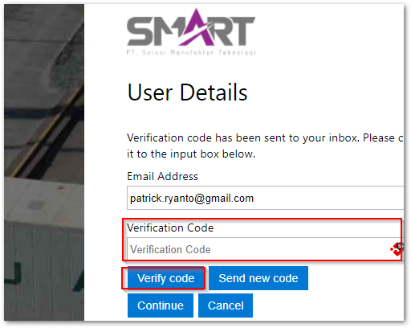
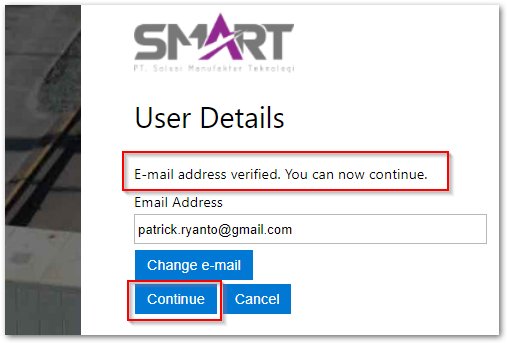
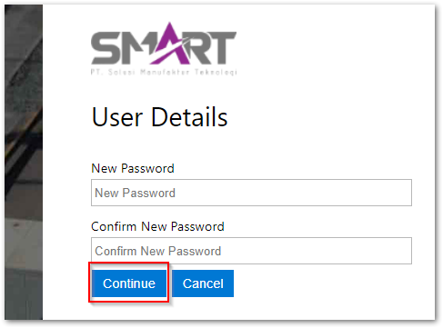
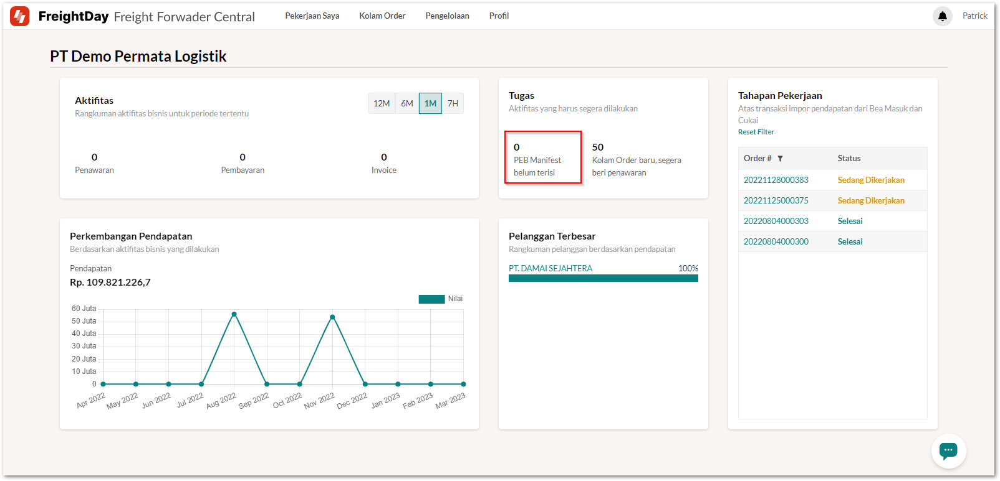
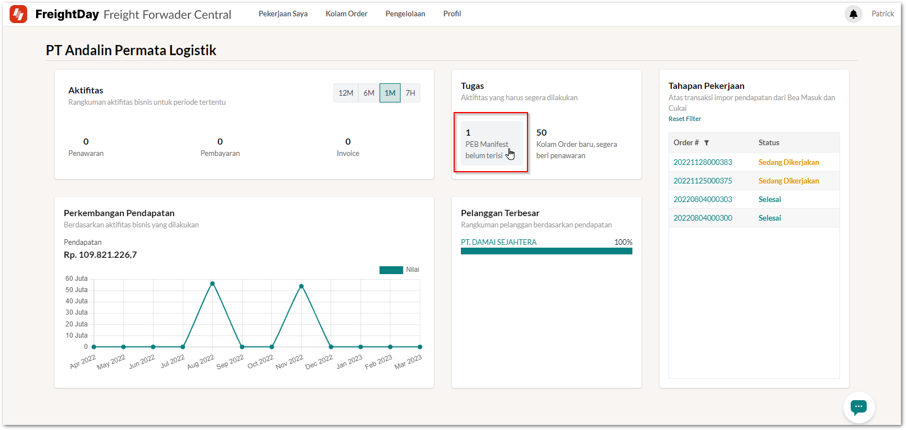
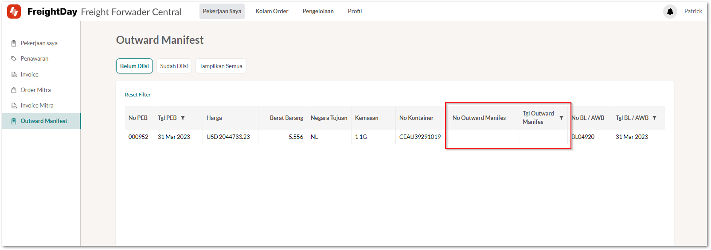
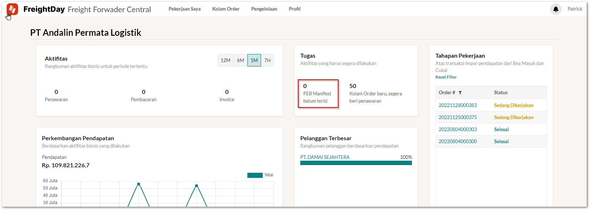

# Outward Manifest
Sebagai vendor logistik dari CDMS, Freight Forwader berkewajiban untuk melengkapi outward manifest atas setiap BC 30 atau PEB yang sudah dibuat.
Untuk dapat mengisi dengan baik silahkan mengikuti panduan di bawah.

## 1. Masuk ke dalam FreightDay
Silahkan menuju https://app.freightday.com, kemudian klik **Forgot your password?**

::: warning
Pastikan sudah memberikan informasi kepada pengguna layanan *freight forwarder*
1. Nama perusahaan *freight forwarder*
2. email PIC dari pihak *freight forwarder*
3. NPWP *freight forwarder*
:::

Masukan email Anda yang sudah Anda berikan sebelumnya kepada pengguna perusahaan pegguna CDMS

Buka email Anda dan masukan kode verifikasi yang telah dikirimkan ke email Anda
Kemudian klik **Verify**

Pastikan sudah menerima pesan "E-mail address verified. You can now continue."
Kemudian klik **Continue**

Masukan password dan konfirmasi password baru
Kemu klik **Continue**

Jika sudah terdapat tampilan seperti ini maka Anda sudah masuk secara sukses ke dalam FreightDay

## 2. Mengisi outward manifest atas suatu PEB
Jika Anda sudah memiliki PEB yang harus diisi outward manifestnya, maka pada panel **Tugas** akan terdapat angka (lebih dari 1) silahkan klik panel tersebut.

Setelah diklik akan muncul tampilan seperti di bawah
Silahkan untuk mengisi nomor dan tanggal outward manifest pada tampilan ini

## 3. Kondisi ideal pada dashbor
Sehingga jika Anda kembali ke dasbor (dengan cara klik logo FreightDay di pojok kiri atas)
Pastikan **PEB Manifest belum terisi** selalu berinlai 0 (nol)

## Pengisian Outward Manifest
Silahkan klik pekerjaan saya dan ikuti video di bawah
<iframe width="560" height="315" src="https://www.youtube.com/embed/NWRq7KvzF5U" title="YouTube video player" frameborder="0" allow="accelerometer; autoplay; clipboard-write; encrypted-media; gyroscope; picture-in-picture; web-share" allowfullscreen></iframe>