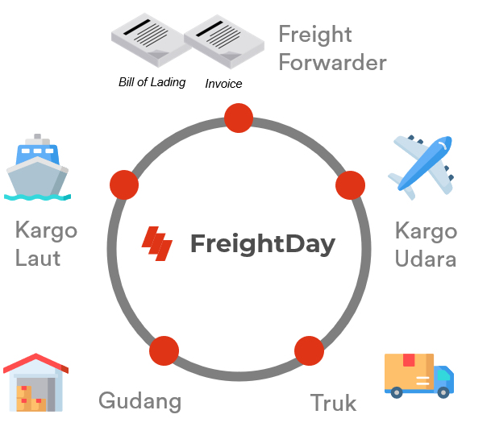

# FreightDay 101
## Apa itu FreightDay?
FreightDay merupakan solusi bagi para importir ataupun eksportir dalam melakukan kolaborasi antar pelaku logistik dalam melakukan suatu proyek logistik

## Manfaat
1. Memberikan kemudahan untuk berkomunikasi dengan seluruh pelaku logistik dari mulai PPJK, penyedia jasa pengiriman kargo lewat laut, udara, penyedia saja gudang, dan penyedia jasa antar darat seperti truk. Karena seluruh pelaku logistik berikut juga dengan data – data perdagangan yang dibutuhkan terpusat dalam satu platform
2. Menghemat biaya logistik yang akan dikeluarkan oleh importir/eksportir, dikarenakan untuk melakukan pencarian pelaku logistik yang menawarkan harga yang kompetitif dengan kualitas yang baik tidak lagi sulit, hanya perlu menggunakan satu platform
3. Memberikan opsi pembiayaan dengan integrasi Cash In. Sehingga importir/eksportir tetap dapat melakukan kegiatan impor atau ekspor dalam keadaan tertentu dengan memanfaatkan jasa pembiayaan Cash In

