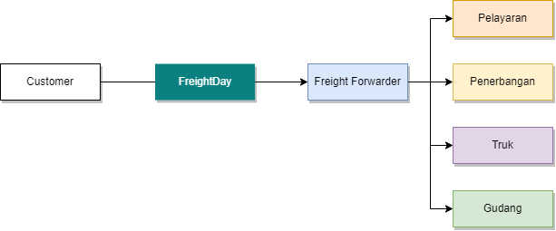
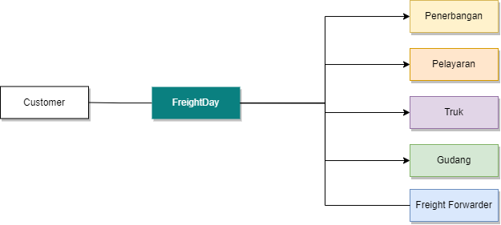
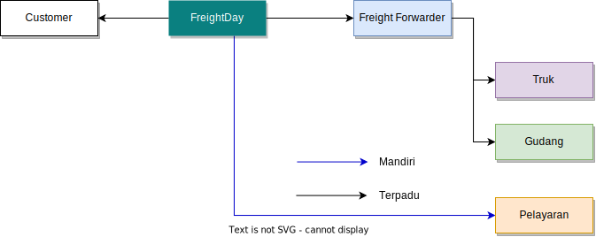

# Jenis Order
Terdapat tiga jenis order yang dapat dijalankan pada FreightDay yaitu:
## 1. Order Terpadu
   
   Sebagai pelanggan atau customer Anda hanya akan berurusan dengan salah satu freight forwarder pada FreightDay.
   Freight Forwarder akan melakukan pengaturan terhadap berbagai vendor logistik untuk menyelesaikan order logistik Anda secara utuh.
::: tip
Jenis ini sangat disarankan jika Anda belum pernah melakukan pengurusan logistik sama sekali sebelumnya
:::
## 2. Order Mandiri
   
   Sebagai pelanggan atau customer Anda akan berurusan langsung dengan seluruh vendor logistik.
   FreightDay menyediakan channel komunikasi 1 pintu namun kami tetap menganjurkan Anda memiliki ilmu logistik yang cukup apik, agar transaksi impor, ekspor, ataupun domestik Anda dapat berjalan dengan lancar.
::: warning
Jenis ini sangat tidak disarankan jika Anda belum pernah melakukan pengurusan logistik sama sekali sebelumnya
:::

  
## 3. Order Terpadu - Mandiri (Hybrid)
   
   Sebagai pelanggan atau customer Anda akan berurusan dengan freight forwarder dan juga vendor logistik.
   Order ini merupakan campuran dari order Terpadu dan Mandiri.
   Pada contoh di atas 
