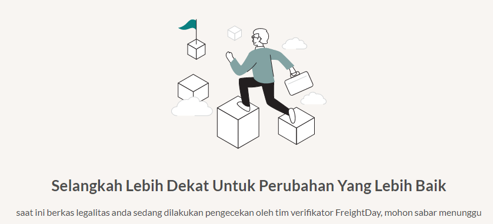

## Step 1: Daftarkan Akun Anda
1. Buka [FreightDay](https://freightday.com)
2. Klik **Sign Up**
3. Klik **Sign Up Now**
4. Masukan Email Address dan klik **Send verification code**
::: info
Pastikan email yang Anda masukan tidak pernah terdaftar pada Klearance, CashIn, ataupun FreigthDay sebelumnya. 
Jika sudah pernah terdaftar silahkan lanjutkan langsung ke [langkah selanjutnya](#step-2-daftar-perusahaan-anda)
:::
5. Masuk ke Email dan masukan kode yang ada di email ke kolom **Verification Code**
6. Kemudian klik **Verify code**
7. Masukan password dan konfirmasi password
8. Masukkan nama dan no. handphone
9. Kemudian klik **Create**

## Step 2: Daftarkan Perusahaan Anda
1. Setelah terbuka FreightDay.com/account/create
2. Silahkan pilih apakah Anda ingin terdaftar sebagai **Vendor** atau **Customer**
3. Masukan informasi Profil Perusahaan Anda
4. Masukan informasi Legalitas Perusahaan Anda
::: warning
Dimohon untuk mengisi segala informasi dengan akurat. Hal ini akan sangat mempercepat proses verifikasi dari FreightDay
:::
5. Jika Anda sudah melihat tampilan seperti pada gambar di bawah, maka mohon untuk menunggu FreightDay dalam melakukan proses verifikasi data

## Step 3: Buka Menu Kolam Order
Untuk dapat memulai memberikan quotation kepada Customer FreightDay.
1. Silahkan klik **Kolam Order** pada bagian atas tengah